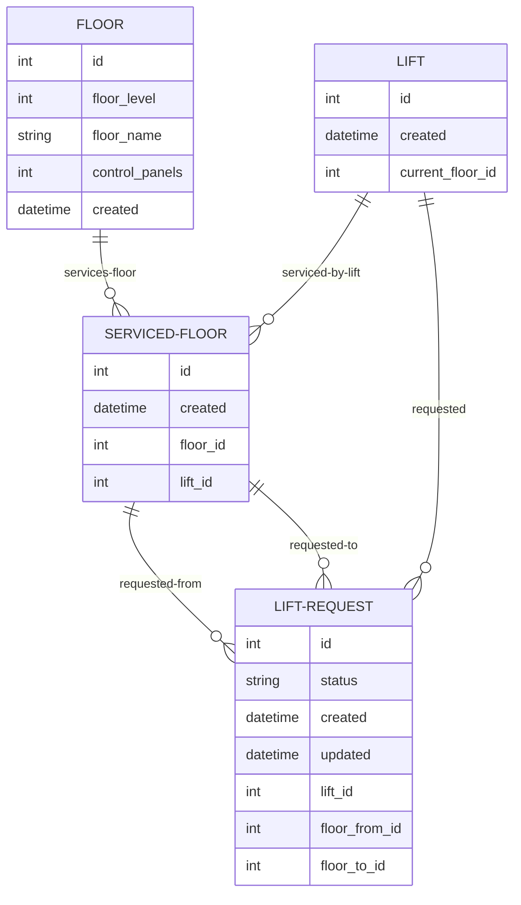

```mermaid
erDiagram
    FLOOR ||--o{ SERVICED-FLOOR : services-floor 
    LIFT ||--o{ SERVICED-FLOOR : serviced-by-lift
    LIFT ||--o{ LIFT-REQUEST : requested
    SERVICED-FLOOR ||--o{ LIFT-REQUEST : requested-from
    SERVICED-FLOOR ||--o{ LIFT-REQUEST : requested-to
    FLOOR {
        int id
        int floor_level
        string floor_name
        int control_panels
        datetime created
    }
    LIFT {
        int id
        datetime created
        int current_floor_id
    }
    LIFT-REQUEST {
        int id
        string status
        datetime created
        datetime updated
        int lift_id
        int floor_from_id
        int floor_to_id
    }
    SERVICED-FLOOR {
        int id
        datetime created
        int floor_id
        int lift_id
    }

```